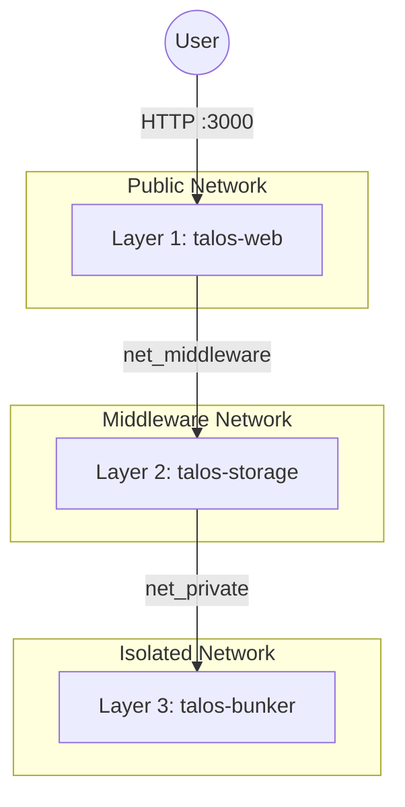

# TALOS // VAULT-OS

[](https://github.com/daniquir/talos/actions)
[](https://opensource.org/licenses/MIT)
[](https://github.com/daniquir/talos/releases)

> **Secure Multi-Layered Password Storage System**
> A self-hosted, GPG-based secret manager with a 3-layer isolated architecture, written in Rust and Dockerized for security.

## ✨ Features

*   **Military-Grade Architecture**: 3-layer isolation (Web -> Storage -> Bunker).
*   **Secure Storage**: GPG encryption with RSA 4096-bit keys.
*   **True Master Key**: The Bunker is sealed at rest. The master key exists only in RAM.
*   **Tree View Navigation**: Hierarchical organization of secrets with categories.
*   **Lazy Loading & Masking**: Secrets are masked by default and only retrieved from the Bunker upon explicit request.
*   **Search & Filter**: Real-time filtering of the secret tree.
*   **Backup & Restore**: Download full encrypted backups as ZIP files and restore them easily.
*   **Git Integration**: Optional automatic versioning and remote backup to a Git repository.
*   **Digital Freeze Mode**: System automatically locks down UI if connection to secure nodes is lost.
*   **Dual Access**: Password and mTLS (Diplomatic Pass).

## 🏗 Architecture

TALOS implements a strict 3-layer security model inspired by military network segmentation ("Air Gap" simulation).



### 🔌 Network Topology & Hardcoded Hostnames

To ensure integrity and prevent configuration drift, internal communication channels are **hardcoded** into the Docker images. The Docker Compose setup must respect these specific container names for DNS resolution to work.

| Service | Container Name | Internal Port | Hardcoded Upstream URL |
|---------|---------------|---------------|------------------------|
| **Web** | `talos-web` | 3000 | `http://talos-storage:4000` |
| **Web (mTLS)** | `talos-web` | 3443 | `http://talos-storage:4000` |
| **Storage** | `talos-storage` | 4000 | `http://talos-bunker:5000` |
| **Bunker** | `talos-bunker` | 5000 | *None (Terminal Node)* |

> ⚠️ **CRITICAL:** Do not change the `container_name` or service names in `docker-compose.yaml`. The Rust binaries are compiled expecting these exact hostnames.

## 💾 Storage Backend Configuration

The `talos-storage` service uses a configuration file to define how secrets are stored. Create a `config/storage.json` file in the project root.

### Git Backend (Recommended)
This mode commits and pushes every change to a remote Git repository, providing versioning and off-site backup.

**`config/storage.json`:**
```json
{
  "backend": {
    "type": "git",
    "repository_url": "git@github.com:YOUR_USERNAME/talos-secrets.git",
    "ssh_key_path": "/run/secrets/id_rsa_talos"
  }
}
```
**Setup:**
1. Generate a dedicated SSH key: `ssh-keygen -t rsa -b 4096 -f ~/.ssh/id_rsa_talos -N ""`
2. Add the public key (`~/.ssh/id_rsa_talos.pub`) as a "Deploy Key" with write access in your GitHub repository settings.
3. The `docker-compose.yaml` file already mounts this key into the container.

### Local Backend
This mode stores secrets only in the local Docker volume. You are responsible for backing up this volume.

**`config/storage.json`:**
```json
{
  "backend": { "type": "local" }
}
```

## � Deployment

### Prerequisites
- Docker & Docker Compose

### Quick Start

1. **Clone the repository**
   ```sh
   git clone https://github.com/daniquir/talos.git
   cd talos
   ```

2. **Launch the System**
   ```bash
   docker-compose up --build -d
   ```

3. **Access Interface**
   Open `http://localhost:3000` in your browser.

## 🔐 Security Protocols

### Initialization (Genesis)
On the first startup, the system will be **UNINITIALIZED**.
1. Access the Web UI.
2. You will be prompted to define your **Master Key**.
3. This key is sent to the Bunker to generate the RSA 4096-bit keys.
4. The Bunker is then **SEALED** with this key.

### Sealed Bunker
If the container restarts, the Bunker loses the key from RAM and becomes **SEALED**.
You must log in via the Web UI using the Master Key to **UNSEAL** it.

### Managing Secrets

*   **Create Category**: Use the "New Category" button to create folders.
*   **Create Secret**: Use "New Secret" to add entries. You can add metadata like User and URL.
*   **Context Menu**: Right-click on the tree items to Edit or Delete.
*   **Copy Password**: Double-click a secret in the tree or use the copy button in the detail view.

## 🛠 Development

The project is structured as a workspace with three microservices:

- **talos-web**: Axum frontend server serving static assets and proxying requests.
- **talos-storage**: Middleware that manages the filesystem (`~/.password-store`).
- **talos-bunker**: Isolated GPG engine. No internet access.

### Frontend Architecture
The web interface is built with vanilla JavaScript using ES Modules for maintainability:

- `js/app.js`: Main controller and event orchestration.
- `js/api.js`: Data layer handling Fetch requests to the backend.
- `js/ui.js`: DOM manipulation and visual effects.

> **Note**: This project is a personal portfolio piece designed to showcase architectural patterns, security considerations, and full-stack development in Rust.

## 📄 License

This project is licensed under the MIT License - see the LICENSE file for details.
